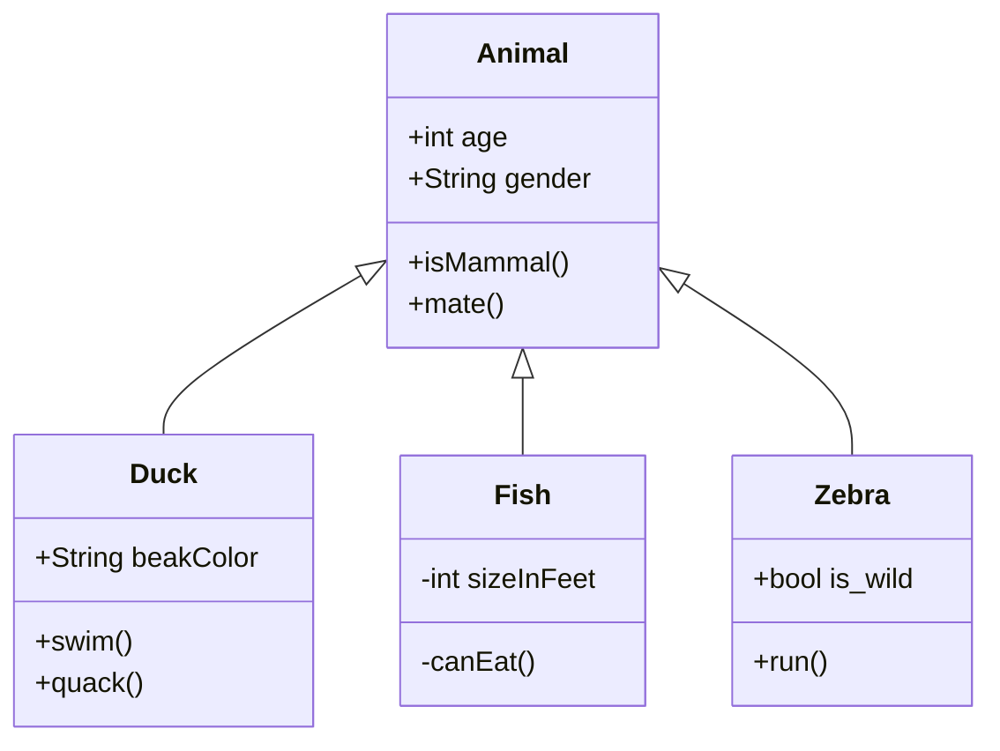
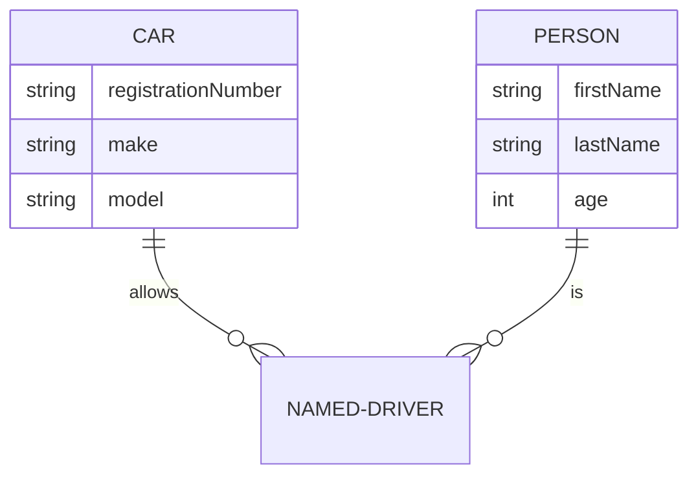
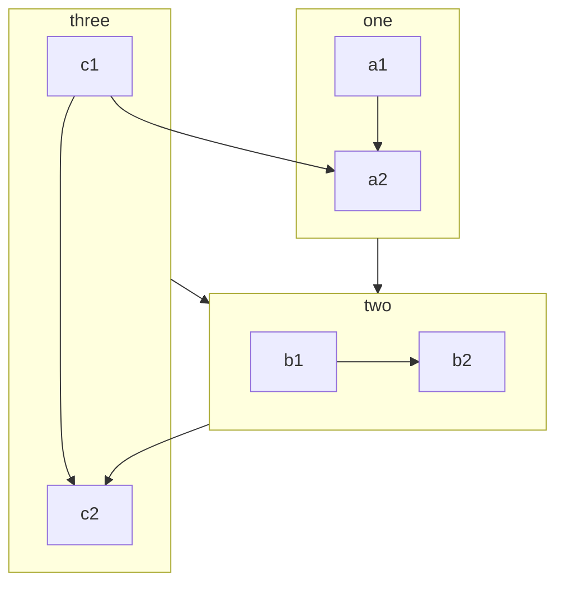
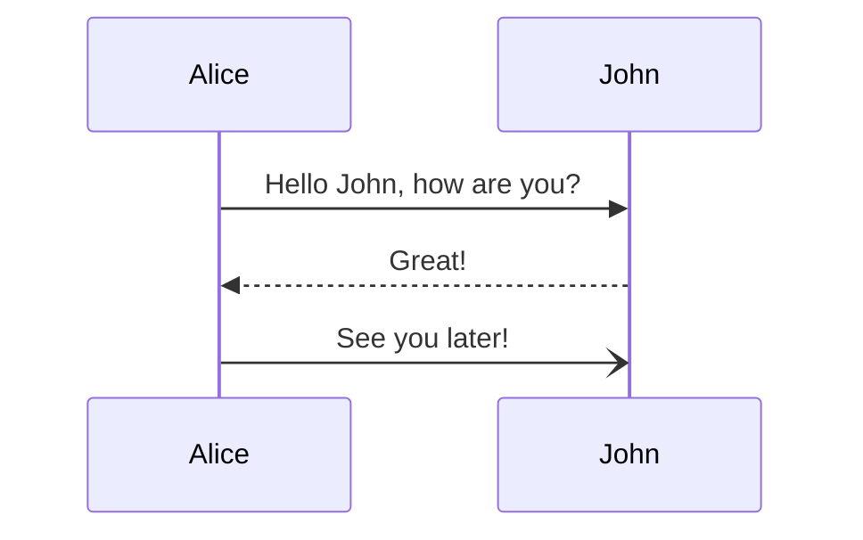
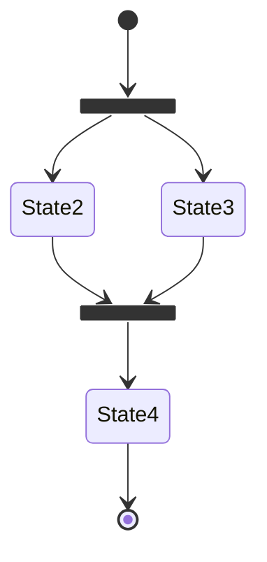

# How to use the documentation system

The documentation system is built with [docsify](https://docsify.js.org/#/zh-cn/), which can directly render markdown documents.

## Syntax Reference

The languages supported for code block highlighting include
`atom`, `bash`, `c`, `cpp`, `css`, `go`, `graphql`, `html`, `java`, `javascript`, `js`, `mathml`,
`python`, `rust`, `rss`, `svg`, `ssml`, `toml`, `xml`, `yaml`

> The following example uses the [docsify-example-panels](https://vagnerdomingues.github.io/docsify-example-panels/#/) plugin.

<!-- panels:start -->
<!-- div:title-panel -->
### LaTex formula

-----
<!-- div:left-panel -->

code

```markdown
    $$E=mc^2\tag{4}$$
    $$\displaystyle\sum_{i=1}^n$$
```

<!-- div:right-panel -->

Appearance

$$E=mc^2\tag{4}$$

$$\displaystyle\sum_{i=1}^n$$

<!-- panels:end -->

### SideBar

-----

The sidebar content is in the _sidebar.md file, 
which can be modified in the root directory, or you can create it in the subdirectory to achieve a nested effect. The content of the file is shown below

```markdown
    <!-- /_sidebar.md -->
    * [Document](/)
    * [Version Info](release/)
```

### Glossary

-----

Add entries in _glossary.md, note that the vocabulary is wrapped with <u> and </u>, 
so that only the vocabulary wrapped in the same way will be converted into hyperlinks to the glossary page. 
The format of the glossary entry is as follows.

```markdown
    ##### <u>word</u>
    Corresponding explanation
```

<!-- panels:start -->
<!-- div:title-panel -->

### Prompt

-----
<!-- div:left-panel -->

code

```markdown
    !> An important piece of content that can be mixed with other Markdown syntax.

    ?> _TODO_ Improve the example
```

<!-- div:right-panel -->

Appearance

!> An important piece of content that can be mixed with other Markdown syntax.

?> _TODO_ Improve the example

<!-- panels:end -->

<!-- panels:start -->
<!-- div:title-panel -->

### Collapse A

-----
<!-- div:left-panel -->

code

```markdown
    Introduction text for the FAQ page.

    + Question 1? +

      Answer 1

    + Question 2? +

      Answer 2
```

<!-- div:right-panel -->

Appearance

Introduction text for the FAQ page.

+ Question 1? +

  Answer 1

+ Question 2? +

  Answer 2

<!-- panels:end -->

<!-- panels:start -->
<!-- div:title-panel -->

### Collapse B

-----
<!-- div:left-panel -->

code

```markdown
  <details>
  <summary>Expand to view</summary>
  <pre><code>

  Text

    ```bash
    echo 123
    ```

  </code></pre>
  </details>
```

<!-- div:right-panel -->

Appearance

<details>
<summary>Expand to view</summary>
<pre><code>

Text

```bash
echo 123
```

</code></pre>
</details>

<!-- panels:end -->

### Pagination

-----

<!-- div:left-panel -->

code

```markdown
    <!-- tabs:start -->

    ### **HTML**

    ```html
    <!-- HTML -->
    <h1>Heading</h1>
    <p>This is a paragraph.</p>
    ```

    ### **JS**

    ```js
    // JavaScript
    function add(a, b) {
    return Number(a + b);
    }
    ```

    ### **CSS**

    ```css
    /* CSS */
    body {
    background: white;
    }
    ```
    <!-- tabs:end -->

```

<!-- div:right-panel -->

Appearance

<!-- tabs:start -->

### **HTML**

```html
<!-- HTML -->
<h1>Heading</h1>
<p>This is a paragraph.</p>
```

### **JS**

```js
// JavaScript
function add(a, b) {
  return Number(a + b);
}
```

### **CSS**

```css
/* CSS */
body {
  background: white;
}
```
<!-- tabs:end -->

<!-- panels:end -->

### Diagram

For more detailed explanation, please refer to[mermaid](https://mermaid-js.github.io/mermaid/#/)
As well as [charty](https://markbattistella.github.io/docsify-charty-docs/#/?id=main)

!> he title field of charty seems to be incompatible with the toc plugin of docsify

<!-- panels:start -->
<!-- div:title-panel -->

#### Class Diagram

-----
<!-- div:left-panel -->

code

```markdown
    ```mermaid
    classDiagram
      Animal <|-- Duck
      Animal <|-- Fish
      Animal <|-- Zebra
      Animal: +int age
      Animal: +String gender
      Animal: +isMammal()
      Animal: +mate()
      class Duck{
          +String beakColor
          +swim()
          +quack()
      }
      class Fish{
          -int sizeInFeet
          -canEat()
      }
      class Zebra{
          +bool is_wild
          +run()
      }
    ```
```

<!-- div:right-panel -->

Appearance



<!-- panels:end -->

<!-- panels:start -->
<!-- div:title-panel -->

#### ER Diagram

-----
<!-- div:left-panel -->

code

```markdown
    ```mermaid
    erDiagram
        CAR ||--o{ NAMED-DRIVER : allows
        CAR {
            string registrationNumber
            string make
            string model
        }
        PERSON ||--o{ NAMED-DRIVER : is
        PERSON {
            string firstName
            string lastName
            int age
        }
    ```
```

<!-- div:right-panel -->

Appearance



<!-- panels:end -->

<!-- panels:start -->
<!-- div:title-panel -->

<!-- panels:start -->
<!-- div:title-panel -->

#### Flowchart

-----
<!-- div:left-panel -->

code

```markdown
    ```mermaid
    flowchart TB
        c1-->a2
        subgraph one
        a1-->a2
        end
        subgraph two
        b1-->b2
        end
        subgraph three
        c1-->c2
        end
        one --> two
        three --> two
        two --> c2
    ```
```

<!-- div:right-panel -->

Appearance



<!-- panels:end -->

<!-- panels:start -->
<!-- div:title-panel -->

#### Sequence Diagram

-----
<!-- div:left-panel -->

code

```markdown
    ```mermaid
    sequenceDiagram
        Alice->>John: Hello John, how are you?
        John-->>Alice: Great!
        Alice-)John: See you later!
    ```
```
<!-- div:right-panel -->

Appearance



<!-- panels:end -->

<!-- panels:start -->
<!-- div:title-panel -->

#### State Transition Diagram

-----
<!-- div:left-panel -->

code

```markdown
    ```mermaid
    stateDiagram-v2
        state fork_state <<fork>>
        [*] --> fork_state
        fork_state --> State2
        fork_state --> State3

        state join_state <<join>>
        State2 --> join_state
        State3 --> join_state
        join_state --> State4
        State4 --> [*]
    ```
```

<!-- div:right-panel -->

Appearance




<!-- panels:end -->

<!-- panels:start -->
<!-- div:title-panel -->

#### Area Chart

-----
<!-- div:left-panel -->

cope

```markdown
    ```charty
      {
        "caption": "With a caption",
        "type":    "area",
        "options": {
          "legend":  true,
          "labels":  true,
          "numbers": true
        },
        "data": [
          {
            "label": "2010",
            "value": [120, 23, 45, 34, 52, 43, 59, 40]
          }
        ]
      }
    ```
```

<!-- div:right-panel -->

Appearance


```charty
{
  "caption": "With a caption",
  "type":    "area",
  "options": {
    "legend":  true,
    "labels":  true,
    "numbers": true
  },
  "data": [
    {
        "label": "2010",
        "value": [120, 23, 45, 34, 52, 43, 59, 40]
     }
  ]
}
```

<!-- panels:end -->

<!-- panels:start -->
<!-- div:title-panel -->

#### Bar Chart

-----
<!-- div:left-panel -->

code

```markdown
    ```charty
      {
        "caption": "With a caption",
        "type":    "bar",
        "options": {
          "legend":  true,
          "labels":  true,
          "numbers": true
        },
        "data": [
          { "label": "2012", "value": [199, 100] },
          { "label": "2014", "value": [85, 217] }
        ]
      }
    ```
```

<!-- div:right-panel -->

Appearance

```charty
{
  "caption": "With a caption",
  "type":    "bar",
  "options": {
    "legend":  true,
    "labels":  true,
    "numbers": true
  },
  "data": [
    { "label": "2012", "value": [199, 100] },
    { "label": "2014", "value": [85, 217] }
  ]
}
```

<!-- panels:end -->

<!-- panels:start -->
<!-- div:title-panel -->

### Image

-----
<!-- div:left-panel -->

code

```markdown
    
```

<!-- div:right-panel -->

Appearance


<!-- panels:end -->

<!-- panels:start -->
<!-- div:title-panel -->
### PDF

-----
<!-- div:left-panel -->

code

!> Need to use absolute path

```markdown
    ```pdf
        /more/howto/assets/Mastering.Go.3rd.Edition.2021.8.pdf
    ```
```

<!-- div:right-panel -->

Appearance

```pdf
    /howto/assets/Mastering.Go.3rd.Edition.2021.8.pdf
```

<!-- panels:end -->

<!-- panels:start -->
<!-- div:title-panel -->

### Audio
-----
<!-- div:left-panel -->

code

```markdown
    [audio](./assets/Hey.Jude.mp3 ':include :type=audio')
```

<!-- div:right-panel -->

Appearance

[audio](./assets/Hey.Jude.mp3 ':include :type=audio')

<!-- panels:end -->

<!-- panels:start -->
<!-- div:title-panel -->

### Video

-----
<!-- div:left-panel -->

code

```markdown
    [video](./assets/docsify.mp4 ':include :type=video')
```

<!-- div:right-panel -->

Appearance

[video](./assets/docsify.mp4 ':include :type=video')

<!-- panels:end -->

<!-- panels:start -->
<!-- div:title-panel -->

### Mind Map

-----
<!-- div:left-panel -->
Refer to more examples[docsify-mindmap](https://up9cloud.github.io/docsify-mindmap/test/demo.html#/)

!> The mind map plugin is not compatible with the syntax of audio and video, they cannot appear on the same page, otherwise it will be like the right side:(

code

```markdown
    ```mindmap
      root
      topic1
          subtopic
      topic2
          subtopic
    ```
```

<!-- div:right-panel -->

Appearance

```mindmap
root
  topic1
    subtopic
  topic2
    subtopic
```

<!-- panels:end -->

<!-- panels:start -->
<!-- div:title-panel -->

### Draw.io

-----
<!-- div:left-panel -->

Not all files are supported, but simple graphics are possible

code

```markdown
    [filename](./assets/test.drawio ':include :type=code')
```

<!-- div:right-panel -->

Appearance

[filename](./assets/test.drawio ':include :type=code')

<!-- panels:end -->
